# Project: Secure Remote Access via L2TP VPN and Scoped RDP
##Project Overview
The objective of this project was to establish a secure method for accessing a home workstation from a remote macOS client. By utilizing an EdgeRouter as a VPN gateway and hardening the Windows host firewall , the project eliminated the need for insecure port forwarding while implementing "Least Privilege" access controls.

##Phase 1: EdgeRouter VPN Configuration
The core of the remote access is an L2TP/IPsec VPN tunnel. This allows the remote client to be "logically" placed inside the home network through an encrypted tunnel.
###1. Defining the Client IP Pool
The router was configured to assign a specific range of internal IP addresses to VPN clients for granular firewall filtering.
```Bash
configure
set vpn l2tp remote-access client-ip-pool start 192.168.1.200
set vpn l2tp remote-access client-ip-pool stop 192.168.1.210
```
###2. Authentication & Network Settings
The VPN uses a Pre-Shared Key (PSK) for machine authentication and local user credentials for access.
```Bash
set vpn l2tp remote-access ipsec-settings authentication mode pre-shared-secret
set vpn l2tp remote-access ipsec-settings authentication pre-shared-secret <SECRET_OMITTED>
set vpn l2tp remote-access authentication mode local
set vpn l2tp remote-access authentication local-users username <USERNAME_OMITTED> password <PASSWORD_OMITTED>
set vpn l2tp remote-access outside-address <ADDRESS_OMITTED>
set vpn l2tp remote-access dns-servers server 8.8.8.8
commit ; save ; exit
```

###3. Perimeter Firewall Rules
To allow VPN traffic through the router's WAN interface (eth0), specific ports were opened on the WAN_LOCAL ruleset.
```Bash
configure
```
Rule for IKE, NAT-T, and L2TP traffic
```Bash
set firewall name WAN_LOCAL rule 30 action accept
set firewall name WAN_LOCAL rule 30 description 'Allow IKE for VPN'
set firewall name WAN_LOCAL rule 30 destination port 500,4500,1701
set firewall name WAN_LOCAL rule 30 protocol udp
```
Rule for ESP (Encapsulating Security Payload)
```Bash
set firewall name WAN_LOCAL rule 40 action accept
set firewall name WAN_LOCAL rule 40 description 'Allow ESP for VPN'
set firewall name WAN_LOCAL rule 40 protocol esp
```

Bind IPsec to the WAN interface

```Bash
set vpn ipsec ipsec-interfaces interface eth0
commit ; save ; exit
```

##Phase 2: Host Hardening (Windows Firewall)
To achieve "Defense in Depth," the Windows Defender Firewall was configured to only allow RDP traffic if it originated from the encrypted VPN tunnel.
###1. Inbound Rule Modification
The standard RDP rules were targeted for modification to ensure both connectivity and performance.
Remote Desktop - User Mode (TCP-In)
Remote Desktop - User Mode (UDP-In)
``###2. IP Scoping (Micro-segmentation)
Instead of allowing "Any IP address," the rules were scoped to strictly whitelisted addresses from the VPN pool.
Remote IP Range: Only allowed traffic from 192.168.1.200 - 192.168.1.210.
Security Impact: This ensures the PC drops any RDP packets not originating from an authenticated VPN session.
###3. Profile Adjustment
Because L2TP tunnels can be classified as "Public" by Windows, the rule was enabled for Domain, Private, and Public profiles. Security is maintained through the IP Scope rather than the network profile.

##Phase 3: Troubleshooting & Validation
During implementation, the command sudo swanctl --log was used on the EdgeRouter to diagnose Phase 1 IKE failures.
Diagnostic Command: sudo swanctl --log
Initial Error Identified: invalid ID_V1 payload length, decryption failed?.
Resolution: Synchronized the Shared Secret between the client and router to resolve the decryption failure.

##Final Results
Encrypted Tunnel: All remote traffic is protected by IPsec.
Access Restored: Remote Desktop is fully functional over the VPN tunnel.
Reduced Attack Surface: RDP ports are strictly limited to verified VPN clients.

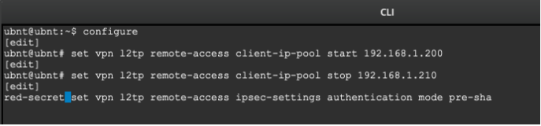
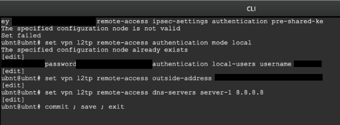
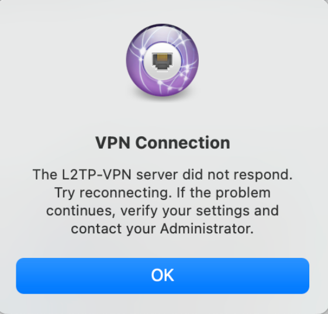
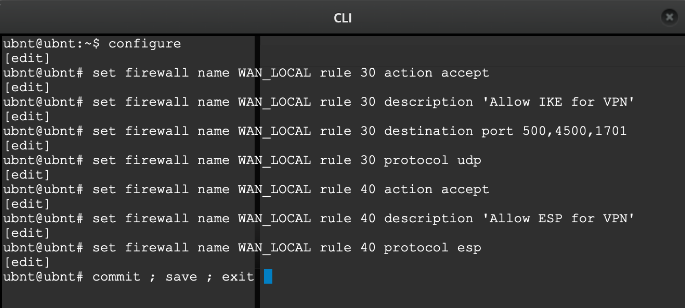
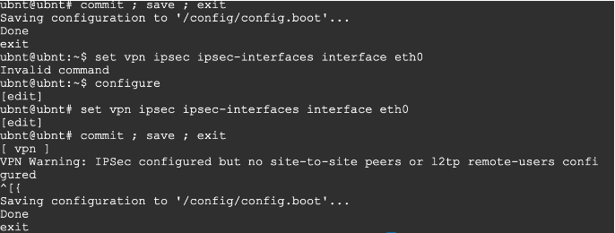
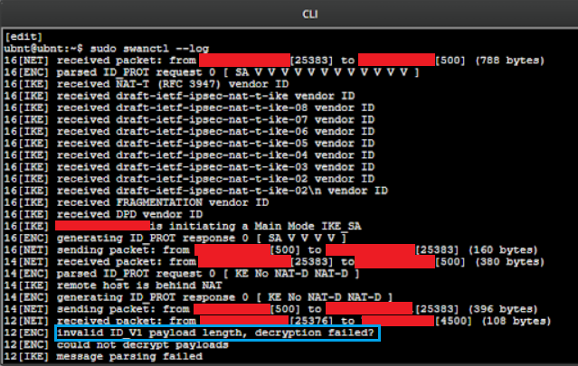
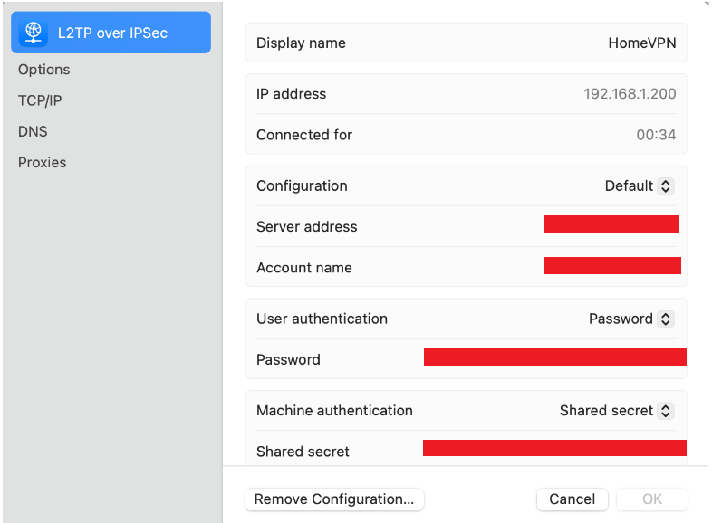
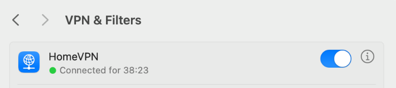
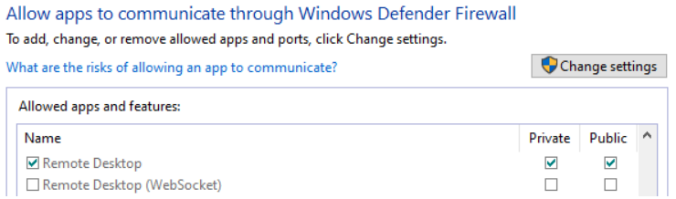
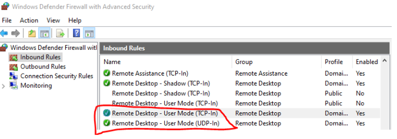
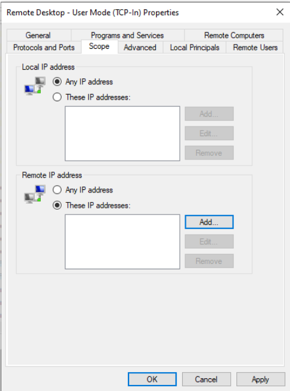
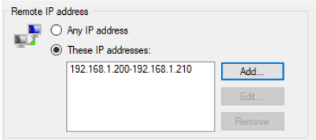
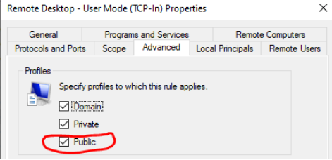
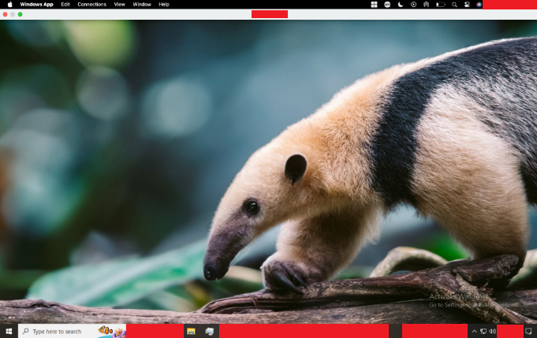


